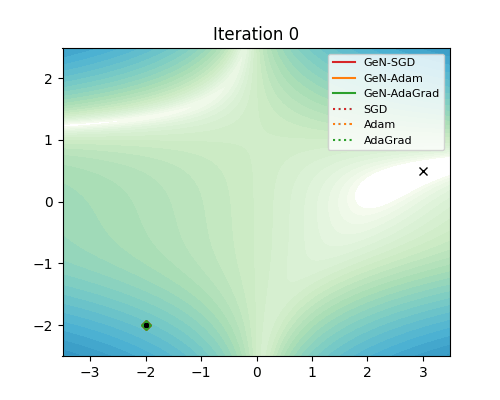
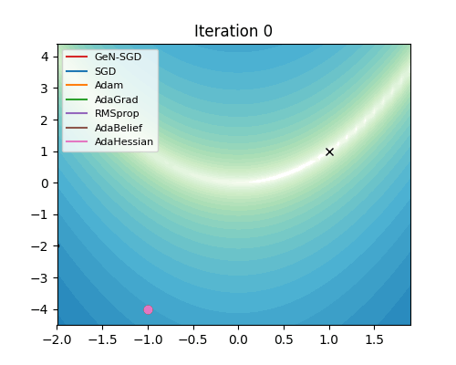
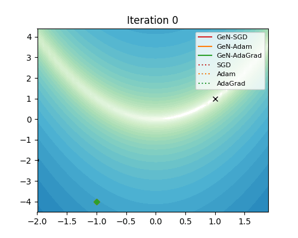
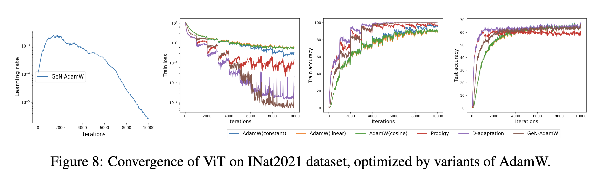
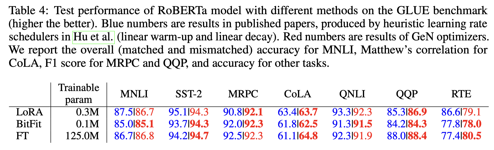
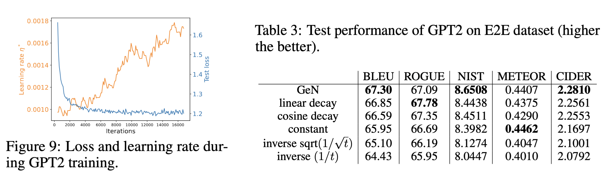
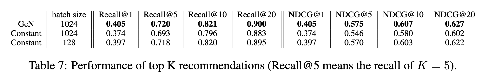

# GeN: Generalized Newton's Method for Learning-Rate-Free Optimization 🚀

---

**Paper:** [Gradient Descent with Generalized Newton’s Method (ICLR 2024)](https://openreview.net/pdf?id=bI3fcTsKW4)

---

## 📦 Repository Overview

This repository contains the code and examples for Generalized Newton's method as a learning-rate-free optimization. It supports a wide range of models and tasks, including:

- 🖼️ Image classification (CIFAR10/CIFAR100/ImageNet... datasets with ViT/ResNet models)
- 📝 Natural language generation (E2E/DART... datasets with GPT2 models)
- 📊 Natural language understanding (SST2/QNLI/MNLI... datasets with BERT/RoBERTa models)
- 🕵️‍♂️ Object detection / Instance segmentation
- 🎯 Recommendation system

Example scripts are provided for each task in the `examples/` directory. The core implementation of GeN optimizer can be found in `GeN/`, which roughly has the same speed and memory cost as the base optimizers.

## ⚡ Quickstart

### 🛠️ Installation

Install the package from PyPI:

```bash
pip install gen-optim
```

Alternatively, install the latest version directly from GitHub:

```bash
pip install git+https://github.com/ShiyunXu/gen-optim
```


### 🏃 Minimal Training Loop

To use GeN in your PyTorch training loop, simply add two lines between `backward()` and `optimizer.step()`:

```python
from GeN import lr_parabola
optimizer = AdamW(model.parameters(), lr=1e-4)
tr_iter = iter(train_loader)

# Standard training pipeline
loss = F.cross_entropy(model(batch), labels)
loss.backward()
if (batch_idx+1) % lazy_freq == 0:
    lr_parabola(model, optimizer, tr_iter=tr_iter, task='image_cls', scale=scale)
optimizer.step()
optimizer.zero_grad()
```

- `scale` can be used to enable the horizon-aware learning rate (e.g., `np.linspace(1,0,epochs+1)`).
- Call `lr_parabola` infrequently (a.k.a. *lazy update*) by setting lazy_freq>=4 for efficiency.
- Different `task` values need different forward passes. Can be customized.

## 🧩 Function Overview

The main function is `lr_parabola`, which adapts the learning rate based on a quadratic curve fitting to the loss landscape, with minimal code changes and computational overhead. This enables learning-rate-free optimization and leverages the Hessian information, like the Newton–Raphson method.

Mathematically, we turn any base optimizer (e.g. SGD or AdamW) to the GeN optimizer by
<p align="center">
  
</p>
where g_t is the stochastic pre-conditioned gradient, G_t is the oracle gradient and H_t is the oracle Hessian.
<br><br>
To enable the horizon-aware GeN, like cosine or linear decay learning rates, we use hyperparameter-free one-to-zero decay (controlled by `scale`):
<p align="center">
  
  &nbsp;&nbsp;&nbsp;&nbsp;&nbsp;
  
</p>

## ✨ Highlights
### 🧪 Synthetic data

<table>
  <tr>
    <td align="center">
      
      <br/>
      <em>Figure 1:</em> Beale (convex) trajectories (all).
    </td>
    <td align="center">
      
      <br/>
      <em>Figure 2:</em> Beale (convex) ours vs non-ours.
    </td>
  </tr>
  <tr>
    <td align="center">
      
      <br/>
      <em>Figure 3:</em> Rosenbrock (non-convex) trajectories (all).
    </td>
    <td align="center">
      
      <br/>
      <em>Figure 4:</em> Rosenbrock (non-convex) ours vs non-ours.
    </td>
  </tr>
</table>

### 🖼️ Image Classification
<p>

</p>

<p>

</p>

### 📊 Natural Language Understanding
<p>

</p>

### 📝 Natural Language Generation
<p>

</p>

### 🕵️‍♂️ Object Detection & Instance Segmentation
<p>

</p>

### 🎯 Recommendation System
<p>

</p>

## 📚 Citation

If you use GeN in your research, please cite:

```bibtex
@inproceedings{bu2024gradient,
  title={Gradient descent with generalized newton’s method},
  author={Bu, Zhiqi and Xu, Shiyun},
  booktitle={The Thirteenth International Conference on Learning Representations},
  year={2024}
}
```
